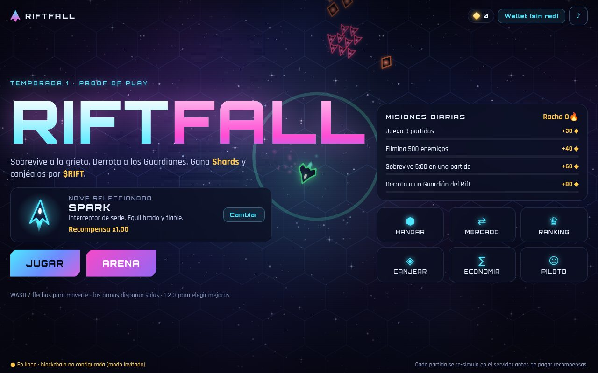
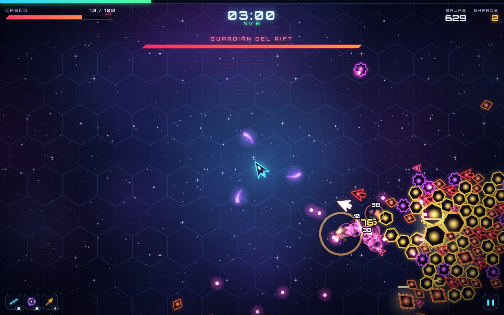
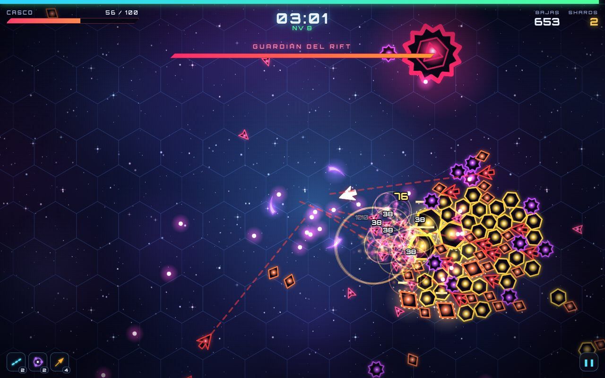
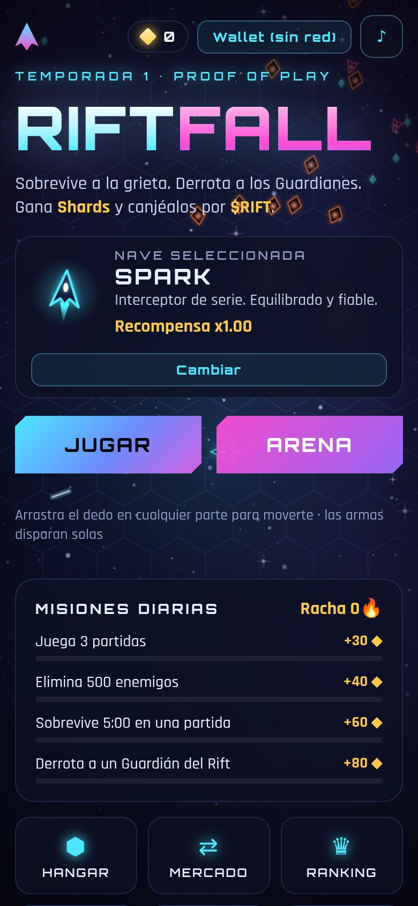

# RIFTFALL

**Juego web de supervivencia arcade con economía on-chain.** Esquiva hordas de enemigos de neón, elige mejoras
en cada subida de nivel, derrota a los Guardianes del Rift y gana **Shards**, que se canjean por el token **$RIFT**.
Las naves son **NFT** que se compran, se forjan y se revenden. En la **Arena** se compite por botes en RIFT.



| Partida | Jefe | Móvil |
|---|---|---|
|  |  |  |

- **Jugable en cualquier navegador** (escritorio y móvil, vertical u horizontal, con joystick táctil). No requiere instalar nada; la wallet solo se pide para cobrar.
- **En español, inglés y portugués:** se elige solo según el idioma del celular (o con `?lang=es|en|pt`) y se puede cambiar desde el menú.
- **Adictivo por diseño:** partidas de hasta 12 minutos, 6 armas y 11 mejoras combinables, **6 evoluciones de armas**, 3 jefes que sueltan **cofres**, **combos**, tutorial, misiones diarias, racha de días, ranking y torneos.
- **Un desafío que no se regala:** la dificultad crece al ritmo del jugador y hay 10 tipos de enemigo. Los últimos llegan en la segunda mitad: minas kamikaze, espectros que se teletransportan, Aegis que blindan a los cercanos y francotiradores con láser.
  - Hay lluvias de meteoritos que también dañan a los enemigos y escuadrones de élite.
  - Para ganar hay que destruir al **Corazón del Rift** (aparece a los 10:00). Si sigue vivo a los 12:00, el Rift colapsa.
  - **Niveles del Rift 1–10:** se desbloquean ganando; cada uno da más vida y daño a los enemigos y **paga más** (hasta x2,5). Se verifican en el replay del servidor.
  - La curva se mide con `node` y el piloto automático; los datos están en [docs/INVESTIGACION-JUGABILIDAD.md](docs/INVESTIGACION-JUGABILIDAD.md).
- **Progreso permanente:** **habilidades del piloto** que se compran con **Núcleos ✦** (moneda de progreso que no se canjea por tokens). Sin servidor, el progreso, las misiones y la racha se guardan en el dispositivo.
- **Viral:** al terminar, el botón **Compartir** genera una imagen con tu resultado y la manda por WhatsApp, Instagram o lo que tenga el celular.
- **Economía con anti-trampas real ("Proof of Play"):** el servidor re-simula cada partida tick a tick antes de pagar.
- **Ingresos para el creador:** venta de naves, comisiones de Forja, Mercado y Arena, regalías y liquidez. Detalle en [`docs/ECONOMIA.md`](docs/ECONOMIA.md).
- **Se instala como app** (PWA) desde el navegador del celular o de la PC, y la partida funciona sin conexión.
- **Desafío diario:** la misma semilla y las mismas reglas para todos, con resultado para compartir y **ranking mundial**:
  la función `api/daily.js` (Vercel) vuelve a jugar cada partida enviada y guarda el top 50 del día en Vercel Blob.
- **Duelo con amigos:** juegas un mapa y mandas el link por WhatsApp; tu amigo juega el mismo mapa con la misma nave y ve
  quién ganó, y puede devolverte el reto. Funciona sin servidor: el link lleva la semilla y la marca.
- **Taller:** 20 piezas coleccionables (cañón, motor, alas y núcleo, 5 niveles cada una) que salen de cajas, cambian
  el aspecto de la nave y dan bonificaciones pequeñas.
- **Cobra antes del token:**
  - **Pase Fundador:** se paga en USDT o BNB en la red principal, directo a la wallet del creador, y el juego verifica
    el pago en la cadena. Da beneficios cosméticos.
  - **Versión para portales** (CrazyGames) con anuncios opcionales, sin cripto y con el progreso guardado en la cuenta
    del jugador: `npm run build:crazygames` genera un único `dist-crazygames/index.html`.
  - Guía completa, grants de BNB Chain y borrador de postulación: [`docs/FINANCIAMIENTO.md`](docs/FINANCIAMIENTO.md).
- **Conseguir jugadores:** textos para cada red, calendario de 2 semanas y videos promocionales en [`docs/REDES.md`](docs/REDES.md).

## Rift Cargo (segundo juego)

En `/cargo/` del mismo sitio está **Rift Cargo**: una empresa de transporte espacial en 3D con estilo de panel de
control (pedidos, mercado, flota, drones de carga y planetas que se mueven). Detalles en
[`docs/RIFT-CARGO.md`](docs/RIFT-CARGO.md). En desarrollo se abre en `http://localhost:5173/cargo/`.

## Cuenta Rift (una cuenta para los dos juegos)

Login con **huella / Face ID** (passkey) o **wallet** (firma gratis), sin contraseñas. El progreso de RIFTFALL y
de Rift Cargo, el nombre, los rankings y las compras (Pase Fundador, estéticos) quedan en la nube y se ven igual
en cualquier dispositivo. Corre en **Cloudflare Pages + D1** (plan gratis): `functions/` y `cloud/`. Detalles,
límites del plan gratis y cómo ponerlo en marcha en [`docs/CUENTA-RIFT.md`](docs/CUENTA-RIFT.md).

**Modo dueño:** con la wallet que cobra las ventas conectada a la cuenta, todo queda desbloqueado sin pagar y la
ventana "Cuenta Rift" muestra un Panel del dueño (Núcleos, talentos, niveles del Rift y piezas en RIFTFALL;
créditos, nivel y mejoras en Cargo).

## Ranking compartido y progreso entre navegadores

- **Ranking de hoy / histórico** (`cloud/api.mjs` + `server/run-board.mjs`): cada partida normal que mejora tu
  marca del día se manda a la web, que hace un control rápido y la anota; después `scripts/audit-runs.mjs` la
  vuelve a jugar con su nave, talentos, piezas y nivel del Rift y saca las que no coinciden. Todos los jugadores
  ven a todos (tarjeta "Ranking de hoy" y panel Ranking). Se guarda en la base D1 de Cloudflare.
- **Progreso que no se pierde** (`src/client/transfer.js`): en el celular, conectar la wallet abre el juego dentro
  de MetaMask, que tiene otra memoria. El progreso, el nombre y el id del ranking viajan comprimidos en el link y
  se suman a lo que hubiera (nunca se pisa algo con partidas por algo vacío). En Habilidades está el botón
  "Copiar link de mi progreso" para seguir en otro dispositivo.

## Inicio rápido (todo en local, con blockchain)

Requisitos: Node.js 22.9 o superior.

```bash
cd riftfall
npm install
npm run build
npm run local          # nodo Hardhat + despliegue de contratos + servidor en http://localhost:8787
```

Para usar una wallet en local, importa en MetaMask la clave **de prueba** de la cuenta #3 de Hardhat, que ya tiene 250.000 RIFT
y 10.000 ETH de prueba (moneda de la red local): `0x7c852118294e51e653712a81e05800f419141751be58f605c371e15141b007a6`.
El juego te propone añadir la red "RIFTFALL Local" (chainId 31337). Esa clave es pública: no la uses nunca fuera de local.

**Solo el juego, sin blockchain** (modo invitado, sin canjes): `npm run build && npm run server`.
Para desarrollo con recarga en caliente usa `npm run server` en una terminal y `npm run dev` en otra (http://localhost:5173).

## Cómo está construido

```
riftfall/
├── contracts/            Solidity (OpenZeppelin 5)
│   ├── RiftToken.sol       $RIFT: ERC-20 de suministro fijo (nombre/símbolo a elección), sin mint ni impuestos
│   ├── RewardVault.sol     pool de recompensas: vales EIP-712, halving cada 180 días, topes diarios, timelock
│   ├── RiftShips.sol       naves ERC-721 con clase y nivel, Forja, SVG on-chain, regalías ERC-2981
│   ├── RiftMarket.sol      mercado P2P sin custodia pagado en RIFT (comisión ≤ 10%)
│   ├── RiftArena.sol       torneos: inscripción, rake ≤ 15%, quema, reparto del bote, reembolsos
│   └── TeamVesting.sol     vesting del equipo (cliff + lineal)
├── src/sim/              simulación DETERMINISTA compartida por navegador y servidor
├── src/client/           render Canvas2D con brillos y partículas, audio sintetizado, UI, wallet (ethers v6)
├── src/launcher/        Lanzador móvil: crea token y contratos desde la wallet del creador
├── src/shared/abis.js    ABIs usados por cliente y servidor
├── src/generated/       bytecode de los contratos para el Lanzador (npm run export:contracts)
├── server/               API Node (sin frameworks): sesiones, replay en workers, vales, misiones, ranking, Arena
├── scripts/              despliegue, stack local, equilibrado con bot y simulador económico
├── test/                 contratos, simulación, servidor, integración on-chain y E2E en navegador
└── docs/                 ECONOMIA.md (diseño), PROYECCION.md (modelo a 24 meses) y ANALISIS-MERCADO.md (qué hace exitoso a un juego cripto)
```

### Proof of Play (anti-trampas)

1. `POST /api/run/start` entrega una semilla aleatoria y fija la nave, cuya propiedad se verifica on-chain.
2. El navegador juega a 60 ticks/s fijos y graba solo las direcciones y elecciones (comprimidas con RLE).
3. `POST /api/run/finish` re-simula la partida completa en un worker y calcula él mismo las recompensas.
   También exige que la partida haya durado en tiempo real lo que dice la simulación.
4. Los Shards se canjean por $RIFT con un vale EIP-712 que el contrato `RewardVault` valida y limita.

## Scripts

| Comando | Qué hace |
|---|---|
| `npm run local` | Stack local completo (blockchain + contratos + servidor + Arena automática) |
| `npm run server` / `npm start` | Solo el servidor (lee `.env`) |
| `npm run dev` | Cliente con recarga en caliente (proxy `/api` → 8787) |
| `npm run build` | Compila el cliente en `dist/` |
| `npm run build:crazygames` | Versión para CrazyGames sin cripto, en un único `dist-crazygames/index.html` |
| `npm test` | Tests de simulación y servidor |
| `npm run test:contracts` | Tests de los contratos (26) |
| `npm run test:integration` | Flujo on-chain completo contra un nodo Hardhat |
| `npm run test:e2e` | Partida real en Chromium verificada por el servidor + móvil |
| `npm run test:e2e:chain` | E2E con wallet: Lanzador completo + comprar, forjar, jugar, canjear, vender y Arena |
| `npm run balance -- 8 spark 1` | Juega 8 partidas con el bot para medir dificultad y recompensas |
| `npm run economy -- --md` | Proyección económica a 24 meses (regenera `docs/PROYECCION.md`) |

## Estado actual: red de pruebas de BNB

El juego publicado está conectado a un despliegue completo en **BNB Smart Chain Testnet** (`deployments/97.json`,
copiado en `public/deployment.json`). Todos los contratos pertenecen a la wallet del creador desde el constructor;
el gas lo pagó una clave descartable cargada con un faucet, que quedó sin tokens, sin roles y sin tBNB.
Los tokens y las naves de esta versión **no tienen valor real**, y el juego lo indica en pantalla.

| Contrato | Dirección (testnet) |
|---|---|
| RiftToken (RIFT) | `0x55370eb683f41fADe8DDFeE96c6351CC802b5d10` |
| RewardVault | `0x7A0aa316BD6FBB9aEfD444c97c677180e0457aBB` |
| RiftShips | `0x17b3196F4146F4Ad50c27cBBc2B2Cb544e62CA2A` |
| RiftMarket | `0x71A383B0DE7bFdf0e7586753D5f614AaB4EB56D7` |
| RiftArena | `0xD7b0D131e7CD8eB0308D9B7AA34E46729785939A` |
| TeamVesting | `0xF53382973a7D50298541218Db9595f84cF181CfF` |

## Lanzar en BNB Chain desde el celular (Lanzador)

La forma más simple, sin computadora y sin compartir claves:

1. Compila el Lanzador con `npm run build:launcher` (carpeta `dist-launcher/`) y publícalo en un sitio **aparte del juego**.
   No va en el build normal: una página que crea contratos y mueve tokens en el mismo dominio que el juego hace que
   los escáneres de las wallets (MetaMask, Blockaid) marquen todo el sitio como sospechoso.
2. Abre `https://SITIO-DEL-LANZADOR/lanzar.html` desde el navegador de tu wallet (MetaMask, Trust Wallet o Binance Web3 Wallet).
3. Elige **BNB Chain Testnet** para probar o **BNB Chain** para la red real, pon nombre y símbolo a tu token y toca **Crear**.
   Son 8 confirmaciones. En la red real cuestan en total **≈ 0,0005 BNB (menos de $1)**. Si la app se cierra, continúa donde quedó.
4. Al terminar: eres dueño de todos los contratos, la tesorería es tu wallet y tienes el 45% del suministro + 15% en vesting.
   Copia la configuración: es el `DEPLOYMENT_FILE` del servidor.
5. Desde la sección **Administración** del Lanzador cobras las ventas de naves y registras la dirección del servidor como firmante.

**Dominio propio antes de vender:** el escáner de seguridad de MetaMask marca como "drainer" a *cualquier* subdominio
gratuito no verificado (`*.vercel.app`, `*.netlify.app`, `*.pages.dev`, `*.github.io`), aunque no exista. Los dominios
propios (`.com`, `.app`, `.fun`…) no tienen ese bloqueo. Mientras el juego no use la wallet no afecta a nadie; antes de abrir
la tienda conviene un dominio propio o pedir la verificación con "Informar sobre un problema de detección".
Hoy el juego se publica en **https://riftfall.duckdns.org** (gratis, sin alerta): en duckdns.org el subdominio apunta a la
IP de Vercel `76.76.21.21` y está agregado como dominio del proyecto en Vercel, que pone el HTTPS solo.
Antes de cambiar de dominio, consulta el escáner: `https://dapp-scanning.api.cx.metamask.io/scan?url=DOMINIO` → `"NONE"` = sin alerta.

**Sin servidor también vende:** si publicas el juego con el `deployment.json` que genera el Lanzador (en `public/`),
la tienda de naves, la forja y el mercado funcionan directamente con la wallet, y las partidas corren en modo práctica.
El canje de Shards, el ranking y la Arena se activan al publicar el servidor.

## Lanzar desde la terminal (alternativa)

1. Copia `.env.example` a `.env` y completa `DEPLOYER_PRIVATE_KEY`, y `RIFT_OWNER` y `RIFT_TREASURY` (tu wallet o una Safe).
   Completa también `RIFT_SIGNER`: la dirección de una clave nueva, solo para el servidor.
   Si otra clave paga el gas por el creador (por ejemplo, una descartable cargada con un faucet de testnet), pon todas las
   direcciones `RIFT_*` en la wallet del creador y `RIFT_DIRECT_OWNER=1`: los contratos nacen a su nombre y quien paga no se queda con nada.
2. `npm run deploy:testnet` (BNB Chain Testnet) → genera `deployments/97.json`. Para la red real: `npm run deploy:mainnet` (BSC, 56).
   Otras redes: `npm run deploy:base-testnet` / `npm run deploy:base`.
3. Configura el servidor en `.env`: `DEPLOYMENT_FILE=deployments/97.json`, `RPC_URL`, `SIGNER_PRIVATE_KEY`, `ADMIN_TOKEN` y `ARENA_AUTO=1`.
4. `npm run build && npm start`.
5. Antes de ir a la red real, sigue el checklist de [`docs/ECONOMIA.md`](docs/ECONOMIA.md#12-checklist-de-lanzamiento).

**Hosting:** cualquier servicio que ejecute Node de forma continua (Railway, Render, Fly.io o un VPS) sirve.
Un solo proceso entrega el juego y la API. Haz copias de seguridad de `server/data/`.
Para miles de jugadores concurrentes, migra `server/db.mjs` a Postgres o Supabase.

**Seguridad de claves:** la clave del deployer y la de la Safe nunca van al servidor. La del servidor
(`SIGNER_PRIVATE_KEY`) solo puede firmar vales dentro de los topes diarios. Si se filtra, pausa el vault,
llama a `setSigner` con una nueva y reanuda.

## Licencias

Código propio del proyecto. Dependencias: OpenZeppelin Contracts (MIT), ethers (MIT), Hardhat (MIT), Vite (MIT),
fuentes Orbitron y Rajdhani (SIL Open Font License). Todos los gráficos y sonidos se generan por código.
